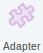
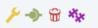
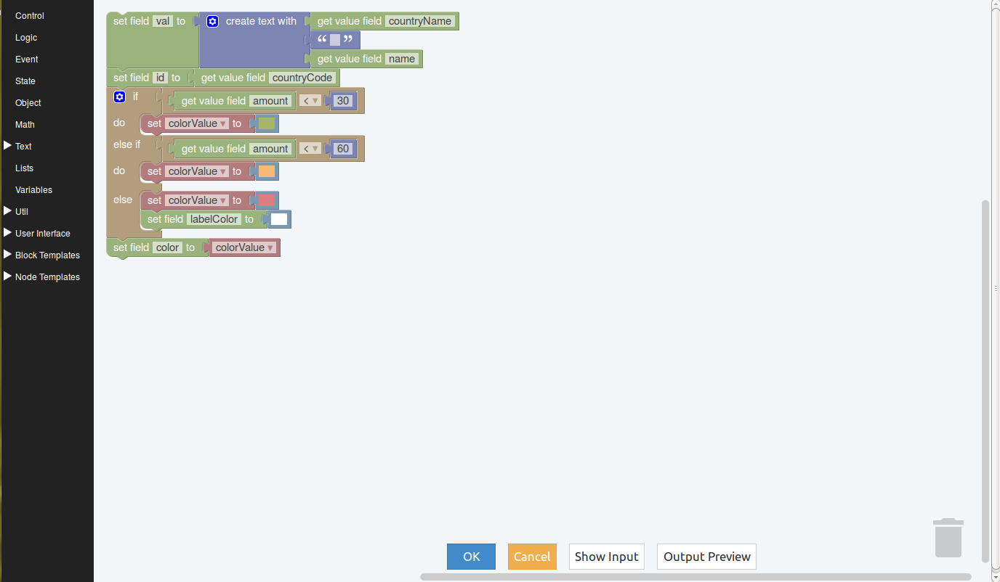
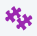

Adapter
-------

Este elemento recibe eventos y aplica la lógica configurada por el usuario para luego emitir el evento bajo ciertas condiciones, en las cuales puede suceder que se hayan agregado campos, bloques o se hayan realizado modificaciones.

En el elemento además, se visualizarán dos contadores en forma de burbujas ubicados en la parte inferior:

 * Burbuja izquierda, es el contador que indica los eventos que ingresan al elemento Adapter.
 * Burbuja derecha, es el contador que indica los eventos que salen luego de atravesar la lógica configurada en el elemento para dichos eventos.

Los contadores pueden ser seleccionados uno por vez y al hacerlo se desplegará una pantalla con el detalle de los eventos enumerados.

Para acceder al menu del elemento se debe realizar clic con botón derecho del mouse sobre el mismo y se deplegará lo siguiente:

.. figure:: ./screenshots/common_menu_settings.png
   :align: left
   
Ajustes
^^^^^^^
Se muestra una nueva área de trabajo propia del elemento en la que se encontrarán herramientas de progración visual.

   
Event Fabric provee de un lenguaje visual para facilitar la programación de la lógica a aplicar en los eventos recibidos.

.. figure:: ./screenshots/common_menu_connection.png
   :align: left
   
Conexión
^^^^^^^^
Acción que permite generar la conexión entre elementos. Luego de seleccionar el icono en el origen, se debe seleccionar el elemento destino y la conexión quedará establecida indicandose mediante una línea entre ambos elementos.

.. figure:: ./screenshots/common_menu_delete.png
   :align: left
   
Eliminar
^^^^^^^^
Acción que permite la eliminación en forma permante del elemento. Con esta acción se eliminará el elemento adaptador y quedará interrumpida la funcionalidad del Dashboard, por lo cual se deberá reacomodar el diseño.

   
Duplicar
^^^^^^^^
Permite generar un nuevo elemento Adapter con la misma configuración realizada en el original.

