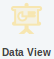
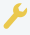
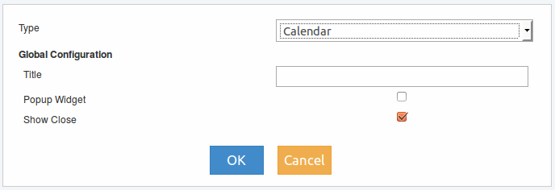
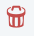

Data View
---------

Este elemento recibe eventos para luego transformalos visualmente en graficos dentro del tablero de control. 

Los eventos llegan a este a través de la conexión con un elemento Adapter o Source. El elemento Data View no está habilitado para generar o pasar eventos a otros, por lo que las conexiones siempre llegarán pero no saldran.

Graficamente dentro de Design se podrán visualizar en el elemento 1 o 2 burbujas con un valor numérico, las cuales representan: 

* Burbuja superior derecha, contador de errores ocurridos. 
* Burbuja inferior izquierda, contador de eventos que llegan al elemento.

Los contadores pueden ser seleccionados uno por vez y al hacerlo se desplegará una pantalla con el detalle de los eventos enumerados.

Para acceder al menu del elemento se debe realizar clic con botón derecho del mouse sobre el mismo y se deplegará lo siguiente:

   

Ajustes
^^^^^^^
Si se accede luego de arratrarlo desde el menu izquierdo al panel derecho se presentará la siguiente ventana de configuración:

En la que se debe seleccionar el tipo de gráfico a incluir en el panel de control, su titulo y (?)

Los tipos de gráficos que se visualicen en la lista Type dependerán de las extensiones o plugin que se seleccionaron al momento de la creación del Dashboard (ver Creación de nuevo Dashboard). También es posible agregar nuevas extensiones ingresando al menú Edit (ver Edit).

Una vez que ya se ha creado el gráfico, al ingresar a Ajustes, se presentará una pantalla diferente que dependerá del tipo de gráfico seleccionado y en ella se encontrará configuraciones propias para el gráfico.

Acceda `aquí`_ para ver información especifica de cada uno de los gráficos disponibles en Event Fabric.

.. _aquí: ././widget/index.html

   
Eliminar
^^^^^^^^
Acción que permite la eliminación en forma permante del elemento. Con esta acción se eliminarán solo las configuraciones realizadas para el gráfico y no se modificarán los eventos generados.

   
Pre visualizar
^^^^^^^^^^^^^^
Se muestra durante 5 segundos como se encuentra actualmente la pantalla del panel de control con los gráficos agregados.

