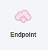
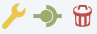
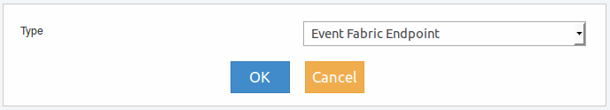

Endpoint
--------

Para acceder al menu del elemento se debe realizar clic con botón derecho del mouse sobre el mismo y se deplegará lo siguiente:

   
.. figure:: ./screenshots/common_menu_settings.png
      :align: left
  
Ajustes
^^^^^^^
Se accede por unica vez luego de arratrarlo desde el menu izquierdo al panel derecho, con lo cual se presentará la siguiente ventana de configuración:

Los tipos de Hub que se pueden seleccionar son los siguientes:

* Event Fabric Endpoint
* Sound

   
Conexión
^^^^^^^^
Acción que permite generar la conexión entre elementos. Luego de seleccionar el icono en el origen, se debe seleccionar el elemento destino y la conexión quedará establecida indicandose mediante una línea entre ambos elementos.

.. figure:: ./screenshots/common_menu_delete.png
   :align: left
   
Eliminar
^^^^^^^^
Acción que permite la eliminación en forma permante del elemento. Con esta acción se eliminará solo el elemento y sus conexiones.
