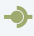
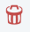

Hub
---

Este elemento funciona como un organizador y ayuda a evitar tener conexiones "mucho a muchos". El Hub recibe un evento de una fuente cualquiera y lo envia a todas sus conexiones sin realizar modificaciones.
Por ejemplo, si tuvieramos un Source, un Timer y un Loader conectados a tres Adapter, como se muestra en la figura, se requiere de 9 conexiones:

Al incorporar un elemento Hub serán necesarias solo seis conexiones:

Para acceder al menu del elemento se debe realizar clic con botón derecho del mouse sobre el mismo y se deplegará lo siguiente:

.. figure:: ./screenshots/common_menu.png
   :align: center
   
.. figure:: ./screenshots/common_menu_settings.png
      :align: left

Ajustes
^^^^^^^
Se accede por unica vez luego de arratrarlo desde el menu izquierdo al panel derecho, con lo cual se presentará la siguiente ventana de configuración:

Los tipos de Hub que se pueden seleccionar son los siguientes:

* Broadcast
* Join
* Round Robin

   
Conexión
^^^^^^^^
Acción que permite generar la conexión entre elementos. Luego de seleccionar el icono en el origen, se debe seleccionar el elemento destino y la conexión quedará establecida indicandose mediante una línea entre ambos elementos.

   
Eliminar
^^^^^^^^
Acción que permite la eliminación en forma permante del elemento. Con esta acción se eliminará el elemento Hub y quedará interrumpida la funcionalidad del Dashboard, por lo cual se deberá reacomodar el diseño.
