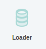
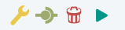
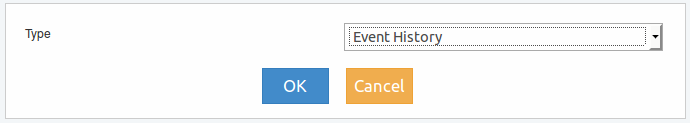

Loader
------

Son elementos que se utilizan para cargar un número establecido de eventos de un conjunto especifico de fuentes. Cuando se inicia el Dashboard, los eventos son cargados, ordenados por tiempo en el que originalmente fueron recibidos y enviados a los elementos conectados a Loader.

Para acceder al menu del elemento se debe realizar clic con botón derecho del mouse sobre el mismo y se deplegará lo siguiente:

   
.. figure:: ./screenshots/common_menu_settings.png
      :align: left

Ajustes
^^^^^^^
Si se accede luego de arratrarlo desde el menu izquierdo al panel derecho, se presentará la siguiente ventana de configuración:

Los tipos de Loader listados serán los siguientes:

* Event History
* Local Store
* Sample Event History
* Store Query

Una vez creado el elemento de carga, al ingresar nuevamente a Ajustes, se presentará una pantalla diferente en la que se podrán establecer configuraciones especificas para el tipo de Loader seleccionado.

.. figure:: ./screenshots/common_menu_connection.png
   :align: left

Conexión
^^^^^^^^
Acción que permite generar la conexión entre elementos. Luego de seleccionar el icono en el origen, se debe seleccionar el elemento destino y la conexión quedará establecida indicandose mediante una línea entre ambos elementos.

.. figure:: ./screenshots/common_menu_delete.png
   :align: left
   
Eliminar
^^^^^^^^
Acción que permite la eliminación en forma permante del elemento. Con esta acción se eliminará el elemento Loader y quedará interrumpida la funcionalidad del Dashboard, por lo cual se deberá reacomodar el diseño.

   
Iniciar
^^^^^^^

