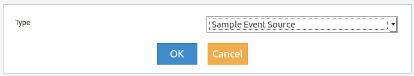
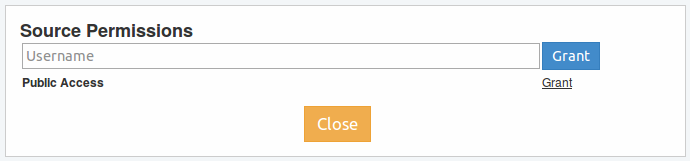

Source
------

   
Este elemento permite realizar la conexión a la fuente en donde se encuentran o se generan los eventos, lo que permite la disponibilidad de los mismos para la generación de los Dashboards.

Para acceder al menu del elemento se debe realizar clic con botón derecho del mouse sobre el mismo y se deplegará lo siguiente:

   
.. figure:: ./screenshots/common_menu_settings.png
      :align: left

Ajustes
^^^^^^^
Si se accede luego de arratrarlo desde el menu izquierdo al panel derecho, se presentará la siguiente ventana de configuración:

   
Los tipos de fuentes listados serán los siguientes:

* Avanced Event Source
* Event Source
* Local Event
* Local Event with Filter
* Local Store Changed
* Sample Event Source

Una vez que ya se ha creado la fuente, al ingresar a Ajustes, se presentará una pantalla diferente de configuración que dependerá del tipo seleccionado y en ella se encontrará configuraciones propias para dicha fuente.

.. figure:: ./screenshots/common_menu_connection.png
   :align: left
      
Conexión
^^^^^^^^
Acción que permite generar la conexión entre elementos. Luego de seleccionar el icono en el origen, se debe seleccionar el elemento destino y la conexión quedará establecida indicandose mediante una línea entre ambos elementos.

.. figure:: ./screenshots/common_menu_delete.png
   :align: left
   
Eliminar
^^^^^^^^
Acción que permite la eliminación en forma permante del elemento. Con esta acción se eliminará la fuente de eventos por lo que el Dashboard creado perderá su funcionalidad.

   
Permisos
^^^^^^^^
Acción que permite otorgar permisos de acceso al elemento. Al seleccionarlo, el usuario puede optar por otorgar permisos a nivel público o para un usuario registrado en Event Fabric en particular:

