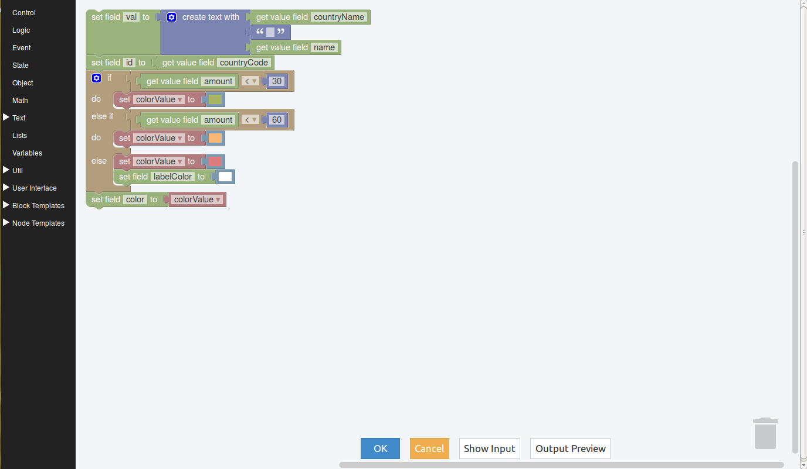

State Holder
------------

Permite la generación de un nuevo evento basado en la acumulación y procesamiento de multiples eventos provenienentes de una misma o diferentes fuentes.

Para acceder al menu del elemento se debe realizar clic con botón derecho del mouse sobre el mismo y se deplegará lo siguiente:

.. figure:: ./screenshots/common_menu.png
   :align: center
   
.. figure:: ./screenshots/common_menu_settings.png
      :align: left

Ajustes
^^^^^^^
Se muestra una nueva área de trabajo propia del elemento en la que se encontrarán herramientas de progración visual. Esta configuración es similar a la que se realiza para el elemento `Adapter`_ y `Filter`_

.. _Adapter: ./adapter.html
.. _Filter: ./filter.html

.. figure:: ./screenshots/common_menu_connection.png
   :align: left
   
Conexión
^^^^^^^^
Acción que permite generar la conexión entre elementos. Luego de seleccionar el icono en el origen, se debe seleccionar el elemento destino y la conexión quedará establecida indicandose mediante una línea entre ambos elementos.

.. figure:: ./screenshots/common_menu_delete.png
   :align: left
   
Eliminar
^^^^^^^^
Acción que permite la eliminación en forma permante del elemento. Con esta acción se eliminará solo el elemento y sus conexiones.
