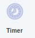
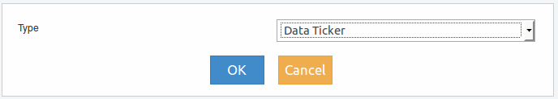

Timer
-----

Este elemento permite configurar una acción para que se ejecute periodicamente cuando algo suceda, como por ejemplo: verificación de la ausencia de eventos o emitir una alerta cuando algo demore más de lo esperado.

Para acceder al menu del elemento se debe realizar clic con botón derecho del mouse sobre el mismo y se deplegará lo siguiente:

.. figure:: ./screenshots/common_menu.png
   :align: center
   
.. figure:: ./screenshots/common_menu_settings.png
      :align: left

Ajustes
^^^^^^^
Si se accede luego de arratrarlo desde el menu izquierdo al panel derecho, se presentará la siguiente ventana de configuración:

Los tipos de timer que se pueden seleccionar son los siguientes:

* Data Ticker
* Group by Time
* Throttler
* Ticker

Una vez seleccionado el tipo y luego de realizar clic con el mouse en el botón OK,  se presentará una nueva pantalla en la que se podrán establecer configuraciones especificas para el tipo seleccionado.

.. figure:: ./screenshots/common_menu_connection.png
   :align: left
   
Conexión
^^^^^^^^
Acción que permite generar la conexión entre elementos. Luego de seleccionar el icono en el origen, se debe seleccionar el elemento destino y la conexión quedará establecida indicandose mediante una línea entre ambos elementos.

.. figure:: ./screenshots/common_menu_delete.png
   :align: left
   
Eliminar
^^^^^^^^

Acción que permite la eliminación en forma permante del elemento. Con esta acción se eliminará el elemento Timer y quedará interrumpida la funcionalidad del Dashboard, por lo cual se deberá reacomodar el diseño.
