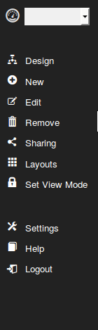
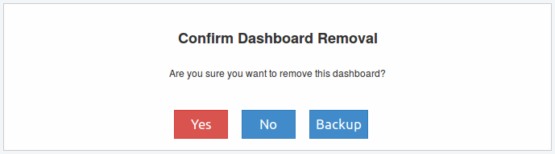

Composición del menú
--------------------

El menú principal se compone de varios accesos que permiten la gestión del dashboard. A continuación se detalla cada uno de estos accesos:

   
   
Lista desplegable
^^^^^^^^^^^^^^^^^
Se ubica en la parte superior y contiene una lista de los Dashboard que han sido creados por el usuario en sesión.

Design
^^^^^^
Al seleccionarlo, nos lleva a la pantalla de diseño del Dashboard. En ella encontramos todos los `Elementos de Diseño`_ necesarios para su creación. Si tenemos un Dashboard creado podemos acceder a esta sección para modificar su funcionalidad.

.. _Elementos de Diseño: ./elements/index.html

New
^^^
Al seleccionarlo se abre una pantalla emergente para la creación del nuevo Dashboard. Dicha pantalla se compone de dos pestañas:

* Create: encontramos el campo *Dashboard Name* para ingresar el nombre y una lista denominada *Extensions* para seleccionar los sources, widgets y theme que se requieran para el nuevo Dashboard.
* Load Example: contiene una lista de Dashboard ya creados a modo de ejemplo.

Edit
^^^^
Al seleccionarlo nos muestra el mismo contenido de la pestaña *Create* en *New* pero con el nombre de nuestro Dashboard actual y las extensiones que habian sido seleccionadas en el momento de su creación. Esta pantalla permite modificar el nombre del Dashboard y agregar y/o quitar extensiones.

Remove
^^^^^^
Se utiliza para la eliminación del Dashboard que se encuentra seleccionado en la pantalla principal. Luego de su selección se pedirá confirmar la acción a través de la siguiente pantalla:

   
En la pantalla de confirmación además de aceptar o cancelar la acción, se da la opción de realizar una copia de seguridad o *backup* del Dashboard. La opción *Backup* realizará la descarga del Dashboard en un archivo Json en el equipo, luego de esto se acepta o rechaza su eliminación.

Sharing
^^^^^^^
Permite compartir el Dashboard en forma publica dentro del ámbito de Event Fabric o seleccionar usuarios especificos.

Layouts
^^^^^^^
Permite seleccionar entre diseños ya creados, la forma de organizar los graficos del Dashboard. El orden que se les da inicialmente es en forma manual realizado por el usuario.

Set View Mode
^^^^^^^^^^^^^
Permite agregar o quitar un marco o borde a cada gráfico del Dashboard.

Settings
^^^^^^^^
Al seleccionarlo se abre una pantalla emergente que permite modificar la configuración de la cuenta, cambiando nombre de usuario, clave de acceso y e-mail.

Help
^^^^
Acceso a la ayuda de Event Fabric.

Logout
^^^^^^
Cierra la sesión en Event Fabric conservando los últimos cambios realizados.