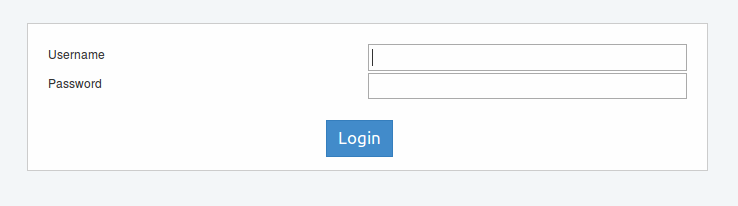
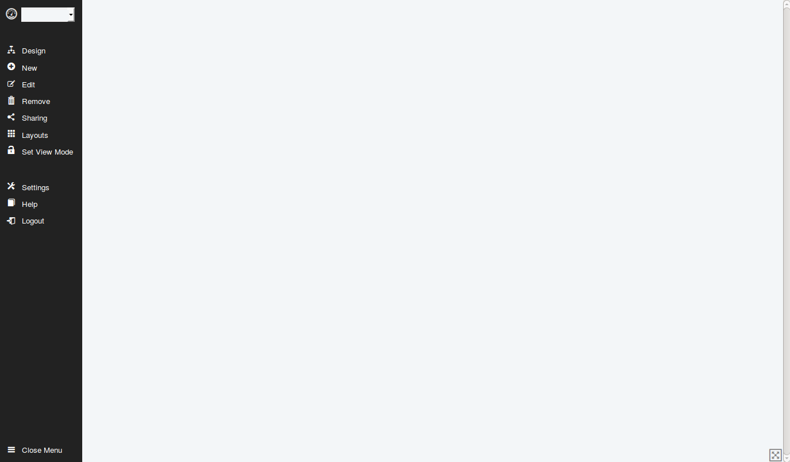
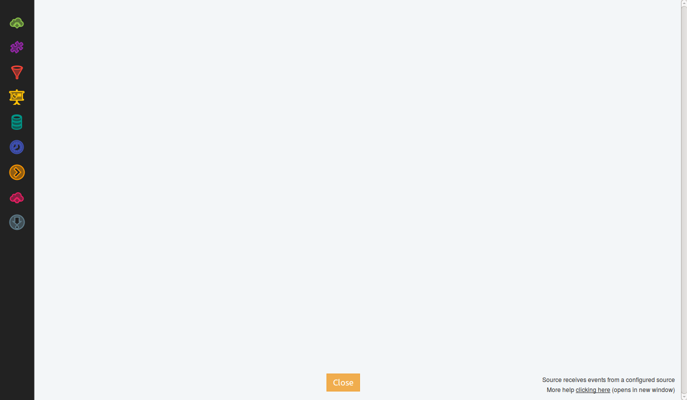

Introducción
============

Event Fabric es...

Interfaz gráfica
----------------
La utilización de Event Fabric es a través de interfaces del tipo web. 
Para acceder a la aplicación se debe iniciar sesión con el nombre de usuario y clave habilitado, utilizando la ventana que se muestra en la figura siguiente:

Al iniciar sesión se presentará la pantalla principal como sigue:
   

Inicialmente se muestra un área en blanco que luego de crear nuestro primer proyecto será el área de visualización del Dashboard. Del lado izquierdo se encuentra el menú principal.   

Una segunda pantalla importante es la de Diseño, a la cual accedemos desde *Design* en el menú izquierdo de nuestra pantalla principal:

   
En esta pantalla visualizamos los elementos de diseño y el área hacia donde arrastraremos cada elemento para crear el diagrama de la funcionalidad del Dashboard. 

En la sección `Elementos de Diseño`_ se explica en detalle cada uno de los elementos.

.. _Elementos de Diseño: ./basics/index.html

Nomenclatura
------------
En esta guía y dentro de la aplicación se encontrará la siguiente terminología:

* Dashboard: se denomina así al conjunto de graficos creados para el proyecto y que se visualizarán en la pantalla principal.
* Widgets: son cada uno de los gráficos que componen el Dashboard. También se utilizará el término "Gráfico" para hacer referencia a él.
* Source: es la fuente de donde se obtienen los eventos. También se utilizará el término "Fuente" para hacer referencia a él.
* Extensions: en la guía utilizaremos la traducción al castellano del término como "Extensiones". Cabe aclarar que en otros ámbitos las extensiones son conocidas como "plugin" y "add-on", el concepto en Event Fabric es el mismo.
